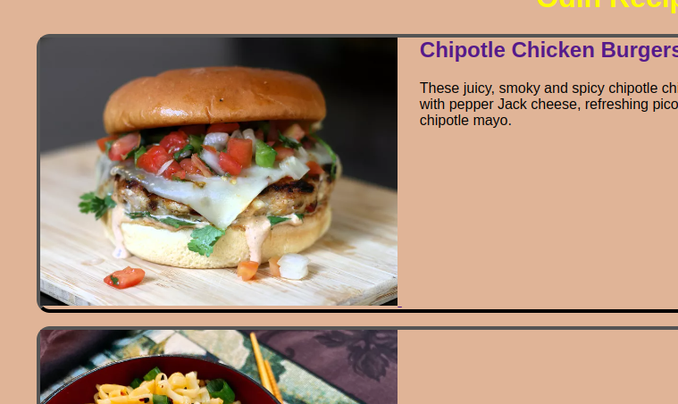

#Devlog

Date: October 4, 2023.

###To Implement:

- Fix empty space below image in recipe card. Potentially an issue with border pixel as the space matches the border pixel size of 4px.

- Update rest of the recipe card to follow the html structure of first one.
- Update style of details_styles.css.

### Resources

https://scrimba.com/scrim/co5024997a7e46c232d9abe55

